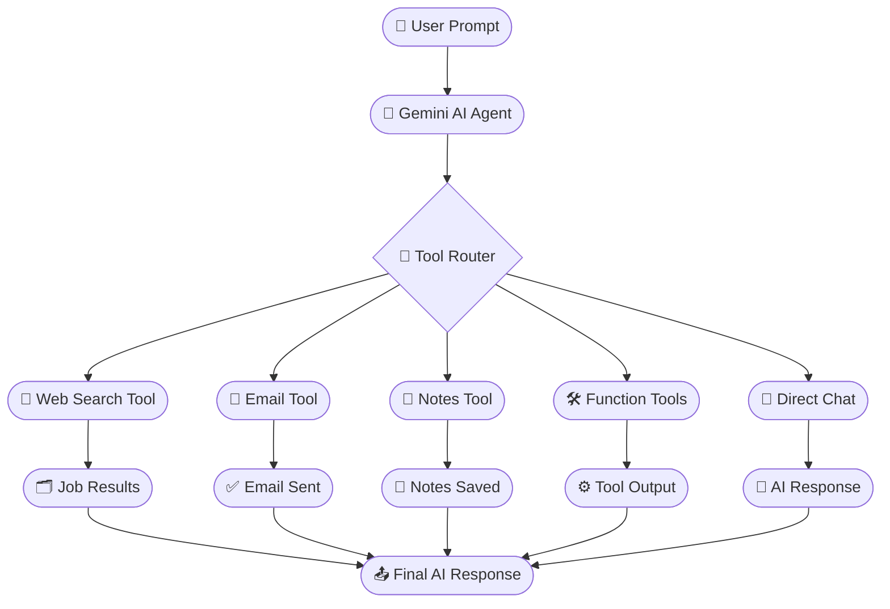

<div align="center">


<br/>

[](https://github.com/YasirAwan4831)
[](https://github.com/YasirAwan4831)
[](https://github.com/YasirAwan4831)
[](./LICENSE)
[](https://github.com/YasirAwan4831)

<br/>


</div>

---

## 📌 Overview

<div align="center">

> **NEXEAGENT Multi-Tool AI Agent** is a production-style AI automation platform built with **Python, Flask, React 19, and Google Gemini AI**. It works as an intelligent AI assistant capable of holding smart conversations, searching remote developer and AI jobs, managing personal notes, sending automated emails, and executing a suite of utility tools — all through a modern, responsive React dashboard.

> Built during the **AI & Automation Internship at [NEXE.AGENT](https://nexe.agent)**, this project demonstrates real-world agentic AI architecture with a clean modular backend and a fully functional frontend.

</div>

<br/>

<div align="center">


</div>

---

## ✨ Core Features

<div align="center">

| 🤖 AI Chat Agent | 💼 Job Search | 📝 Notes Manager |
|:----------------|:-------------|:----------------|
| Gemini-powered AI assistant | Search remote developer jobs | Save AI conversation summaries |
| Smart function routing system | AI & Automation job listings | Store important links & notes |
| Context-aware chat responses | Python / Flask / React positions | Edit & Delete notes |
| Full chat history management | Full-stack opportunities | JSON-based persistent storage |
| Intelligent prompt handling | Smart filtering & AI summaries | Timestamp & metadata support |

| 📧 Email Automation | 🛠️ Function Tools | 🎨 Modern UI Dashboard |
|:-------------------|:-----------------|:----------------------|
| Gmail SMTP integration | 🔢 Calculator | React 19 + Vite frontend |
| Fully automated email sending | 🔗 URL extractor | Tailwind CSS styling |
| AI job update notifications | 📄 Text summarizer | Responsive dashboard layout |
| AI-generated email summaries | 🗂️ JSON formatter | Full dark mode support |
| Notification & alert support | 🔑 Keyword extraction | Framer Motion animations |

</div>

---

## 🛠️ Tech Stack

<div align="center">

| Category | Technology | Purpose |
|:---------|:-----------|:--------|
|  | Python 3.11+ | Core backend logic & automation |
|  | Flask | REST API server & routing |
|  | React 19 | Frontend UI & component architecture |
|  | Vite | Lightning-fast frontend build tool |
|  | Tailwind CSS | Utility-first styling framework |
|  | Google Gemini 2.0 Flash | AI model for chat & function calling |
|  | Gmail SMTP | Automated email sending |
|  | Framer Motion | UI animations & transitions |
|  | JSON Files | Lightweight persistent storage |
|  | Remotive Jobs API | Remote job search integration |
|  | Git + GitHub | Version control |

</div>

---

## 🧠 AI Agent Workflow



---

## 🏗️ Project Architecture

```
nexeagent-multi-tool-ai-agent/
│
├── 📁 backend/                        # Python Flask Backend
│   ├── 🐍 app.py                      # Flask Application Entry Point
│   ├── ⚙️  config.py                  # Configuration & Environment Loader
│   │
│   ├── 📁 data/                       # JSON Database Files
│   │   ├── 📄 notes.json              # Notes Storage
│   │   ├── 📄 jobs.json               # Saved Jobs Storage
│   │   ├── 📄 logs.json               # System Logs
│   │   └── 📄 chat_history.json       # Conversation History
│   │
│   ├── 📁 routes/                     # Flask API Route Handlers
│   │   ├── 🔗 chat_routes.py
│   │   ├── 🔗 job_routes.py
│   │   ├── 🔗 email_routes.py
│   │   ├── 🔗 notes_routes.py
│   │   └── 🔗 tools_routes.py
│   │
│   ├── 📁 services/                   # Business Logic Services
│   │   ├── 🤖 gemini_service.py       # Google Gemini AI Integration
│   │   ├── 📧 email_service.py        # Gmail SMTP Email Service
│   │   ├── 🔎 job_service.py          # Remotive Jobs API Service
│   │   └── 📝 notes_service.py        # Notes CRUD Operations
│   │
│   ├── 📁 tools/                      # Utility Tool Implementations
│   │   ├── 🔢 calculator.py
│   │   ├── 🔗 url_extractor.py
│   │   ├── 📄 summarizer.py
│   │   ├── 🗂️  json_formatter.py
│   │   └── 🔑 keyword_extractor.py
│   │
│   ├── 📁 prompts/                    # AI System Prompts & Templates
│   ├── 📁 utils/                      # Helper Utilities
│   └── 📁 scripts/                    # Automation & Maintenance Scripts
│
├── 📁 frontend/                       # React 19 + Vite Frontend
│   ├── 📁 src/
│   │   ├── 📁 components/             # Reusable UI Components
│   │   ├── 📁 pages/                  # Application Pages
│   │   │   ├── 🏠 Home.jsx            # Main Dashboard
│   │   │   ├── 💼 Jobs.jsx            # AI Job Search
│   │   │   ├── 📝 Notes.jsx           # Notes Manager
│   │   │   ├── 📧 Email.jsx           # Email Automation
│   │   │   └── 🛠️  Tools.jsx          # Utility Tools
│   │   ├── 📁 services/               # API Call Handlers
│   │   └── 📁 assets/                 # Images & Static Assets
│   │
│   ├── ⚙️  vite.config.js
│   └── 📦 package.json
│
├── 📄 requirements.txt                # Python Dependencies
├── 📜 LICENSE                         # Proprietary License
└── 📖 README.md
```

---

## 🚀 Installation Guide

### 📋 Prerequisites


---

**1️⃣ Clone the Repository**

```bash
git clone https://github.com/YasirAwan4831/nexeagent-multi-tool-ai-agent.git
cd nexeagent-multi-tool-ai-agent
```

---

**2️⃣ Backend Setup — Create & Activate Virtual Environment**

```bash
cd backend
python -m venv venv

# Windows
venv\Scripts\activate

# macOS / Linux
source venv/bin/activate
```

---

**3️⃣ Install Python Dependencies**

```bash
pip install -r requirements.txt
```

---

**4️⃣ Configure Environment Variables**

Create a `.env` file inside the `backend/` folder:

```env
GEMINI_API_KEY=your_gemini_api_key_here
GEMINI_MODEL=gemini-2.0-flash

SMTP_USER=your_email@gmail.com
SMTP_PASSWORD=your_gmail_app_password
EMAIL_FROM=your_email@gmail.com
```

> 🔐 **Never commit your `.env` file to GitHub. It is listed in `.gitignore`.**

---

**5️⃣ Start the Backend Server**

```bash
python app.py
```

> ✅ Backend running at → `http://127.0.0.1:5000`

---

**6️⃣ Frontend Setup & Launch**

```bash
cd ../frontend
npm install
npm run dev
```

> ✅ Frontend running at → `http://localhost:5173`

---

## 📡 API Endpoints Reference

<div align="center">

### 🤖 Chat Endpoints

| Method | Endpoint | Description | Status |
|:------:|:---------|:------------|:------:|
|  | `/api/chat/message` | Send a message to Gemini AI | ✅ Active |
|  | `/api/chat/history` | Fetch full chat history | ✅ Active |

### 💼 Jobs Endpoints

| Method | Endpoint | Description | Status |
|:------:|:---------|:------------|:------:|
|  | `/api/jobs/search` | Search remote AI / dev jobs | ✅ Active |
|  | `/api/jobs/saved` | Fetch saved job listings | ✅ Active |

### 📧 Email Endpoints

| Method | Endpoint | Description | Status |
|:------:|:---------|:------------|:------:|
|  | `/api/email/send` | Send automated email | ✅ Active |
|  | `/api/email/status` | Check email config status | ✅ Active |

### 📝 Notes & Tools Endpoints

| Method | Endpoint | Description | Status |
|:------:|:---------|:------------|:------:|
|  | `/api/notes` | Create, Read, Update, Delete notes | ✅ Active |
|  | `/api/tools/<tool_name>` | Execute a specific utility tool | ✅ Active |

</div>

---

## 🖥️ Frontend Pages

<div align="center">

| 🗂️ Page | 📝 Description | 🔗 Route |
|:--------|:--------------|:---------|
| 🏠 **Home** | Main AI chat dashboard & overview | `/` |
| 💼 **Jobs** | AI-powered remote job search | `/jobs` |
| 📝 **Notes** | Personal notes & AI summaries manager | `/notes` |
| 📧 **Email** | Email automation & notification center | `/email` |
| 🛠️ **Tools** | Utility tools — calculator, formatter, etc. | `/tools` |

</div>

---

## 🗄️ JSON Database Files

```bash
📄 notes.json           # Saved notes & AI summaries
📄 jobs.json            # Saved & fetched job results
📄 logs.json            # System activity & error logs
📄 chat_history.json    # Full conversation history
```

> ♻️ The system **automatically creates** any missing JSON files on first run.

---

## 🔒 Security Features

<div align="center">

| 🛡️ Security Layer | ✅ Implementation |
|:-----------------|:----------------|
| 🔑 API Key Protection | Stored in `.env`, never in source code |
| 📧 SMTP Credential Isolation | Gmail App Password via environment variables |
| ✅ Input Validation | All API inputs sanitized before processing |
| 🚫 Error Handling System | Global Flask error handlers with safe messages |
| 📋 Request Logging | Activity logs stored in `logs.json` |
| ⚙️ Secure Config Loading | `python-dotenv` based environment management |

</div>

---

## 📈 Development Phases

<div align="center">

```
Phase 1 ✅          Phase 2 ✅          Phase 3 ✅          Phase 4 ✅
━━━━━━━━━━━━━━━━━━━━━━━━━━━━━━━━━━━━━━━━━━━━━━━━━━━━━━━━━━━━━━━━━━━━
Project Setup      Gemini AI           Job Search          Notes Manager
& Architecture     Integration         Automation          System

Phase 5 ✅          Phase 6 ✅          Phase 7 ✅
━━━━━━━━━━━━━━━━━━━━━━━━━━━━━━━━━━━━━━━━━━━━━━━━━
Email              React Dashboard     Testing &
Automation         Frontend            Optimization
```

</div>

---

## 🌟 Project Highlights

<div align="center">

| ✅ Highlight | 📋 Details |
|:------------|:-----------|
| 🏗️ Production-Style Architecture | Clean MVC backend, modular services, layered design |
| 🤖 Gemini 2.0 Flash Integration | Real AI function calling & tool routing |
| 💼 Live Job Search | Remotive API integration for real remote jobs |
| 📧 Gmail Automation | Full SMTP email pipeline with AI-generated content |
| 📝 Notes System | Full CRUD with JSON persistence & timestamps |
| 🛠️ Multi-Tool Suite | 5+ utility tools integrated into the AI agent |
| 🎨 Responsive Dashboard | React 19 + Tailwind + Framer Motion UI |
| 🔒 Secure Config | Environment variable-based secret management |
| 📄 Internship-Ready Docs | Full documentation for professional review |

</div>

---

## 📜 License

<div align="center">

[](./LICENSE)

This project is protected under a **Custom Proprietary License**.

Unauthorized **copying**, **redistribution**, **commercial usage**, **modification**, or **resale** of this project is strictly prohibited without written permission from the owner.

> See [`LICENSE`](./LICENSE) for complete details.

</div>

---

## 👨‍💻 Developer

<div align="center">


<br/>

[](https://github.com/YasirAwan4831)
[](https://www.linkedin.com/in/yasirawan4831)
[](https://yasirawaninfo.vercel.app)
[](https://yasirawan4831.github.io/futuristic-links-dashboard/)

<br/>


<br/>

*AI & Automation Internship Project — © 2026 **Muhammad Yasir** — NEXE.AGENT*

</div>

---

<div align="center">

### ⭐ If this project impressed you, leave a star!

[](https://github.com/YasirAwan4831/nexeagent-multi-tool-ai-agent)


</div>

